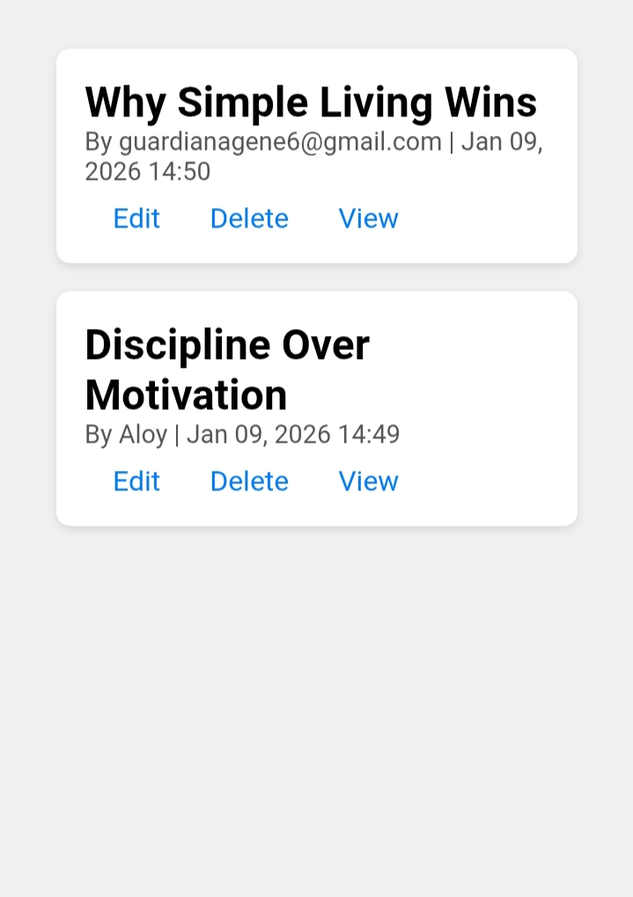
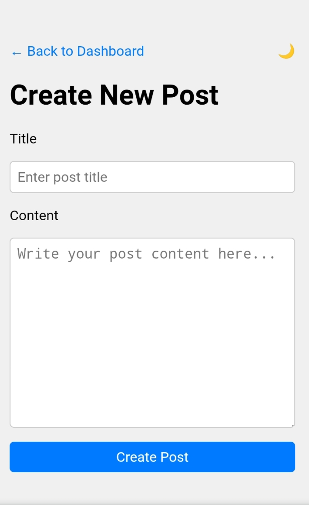

# Flask Blog

A simple Flask-based blog application with user authentication, post management, and clean UI.

## Features
- User registration and login system
- Create, edit, and delete posts
- Post slugs for clean URLs (/post/)
- Dashboard for managing posts
- Author and timestamp tracking for each post
- SQLite database (stored in instance/blog.db)
- Fully customizable templates (templates/) and static files (static/)
- Tailwind CSS for responsive and clean UI
- Ready for deployment on Render free tier

## Live Demo
Check the live blog deployed on Render: [Flask Blog Live](https://flask-blog-ppop.onrender.com/dashboard)

## Screenshots

### Dashboard


### Create Post


### Post View


## Setup & Installation

1. **Clone the repository:**
```bash
git clone https://github.com/Seven25-ui/flask_blog.git
cd flask_blog
Create a virtual environment and activate it:
Copy code
Bash
# Linux / macOS / Termux
python3 -m venv venv
source venv/bin/activate

# Windows
venv\Scripts\activate
Install dependencies:
Copy code
Bash
pip install -r requirements.txt
Run the app locally:
Copy code
Bash
python app.py
Open in browser:
Copy code

http://127.0.0.1:5000
First time: register a user → login → access dashboard → create posts.
Deployment on Render (Free Hosting)
Push repo to GitHub (public or give access to Render)
Go to Render → New → Web Service → Connect GitHub → Select flask_blog
Runtime: Python 3.11
Build command:
Copy code
Bash
pip install -r requirements.txt
Start command:
Copy code
Bash
gunicorn app:app
Optional: Add environment variables like SECRET_KEY if needed
Deploy → live URL: https://flask-blog-ppop.onrender.com/dashboard
Git Cleanup Script
You can run clean_git.sh to compress Git history and force-push changes:
Copy code
Bash
./clean_git.sh
Useful if your repo has too many large files or you just added .gitignore.
Project Structure
Copy code

flask_blog/
├─ app.py              # Main Flask app
├─ README.md           # Project documentation
├─ clean_git.sh        # Script to clean & compress Git history
├─ bfg.jar             # Optional BFG Repo Cleaner jar
├─ instance/           # Database and instance folder (ignored in git)
├─ venv/               # Virtual environment (ignored in git)
├─ __pycache__/        # Python cache
├─ static/             # CSS, JS, images
├─ templates/          # HTML templates
└─ images/             # Screenshots for README
Contribution
Fork the repo
Make changes / improvements
Create a pull request
License
MIT License — free to use and modify.
# my-flask-blog
